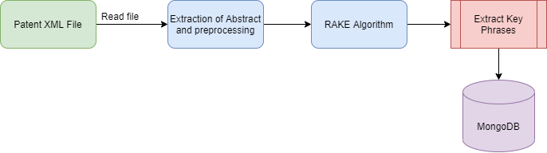

# Patent_KeyWord_Extractor



## Getting Started
#### Prerequisites
* Install MongoDB client and start the service locally. Go to MongoDB install directory -> bin -> Run mongo and mongod in two differnt terminals. 
```
Download the mongoDB Community .msi installer : https://www.mongodb.com/try/download/community?tck=docs_server.
Run the MongoDB installer.
Follow the MongoDB installation Wizard.
Install mongoDB as a service and also check the option to install mongoDB compass.
Install mongosh - https://docs.mongodb.com/mongodb-shell/install/


## Pipeline
The general flow of the pipeline is depicted in the flowchart above and is explained below : 
* Read the patent xml file.
* Extract the abstract text. The text is preprocessed which inlcudes lemmatization and removal of tags. The data is cleaned in this stage.
* The text is then to the RAKE(Rapid Automatic Keyword Extraction) algorithm. The algorithm removes stopwords and ranks the important keywords and keyphrases that commonly occur in the text.
* The extracted keywords are then stored in monogDB as a json mapped to the patent filename.


```
## Program changes required - extract_rake.py
* Replace the relative path to the folder containing the patents. "DIR" variable stored the path of the patent folder.


## Run Docker


In the cloned repository folder open up command promp and run the below commands. This will set up a mongoDB instance for the program to idenify and store the keywords extracted from text.
```
docker-compose up --build
```

To view the mongoDB collection download mongo compass. Click connect and use this connection string to find the database collection.
```
mongodb://db:secret@db:27017/?authSource=admin

```
